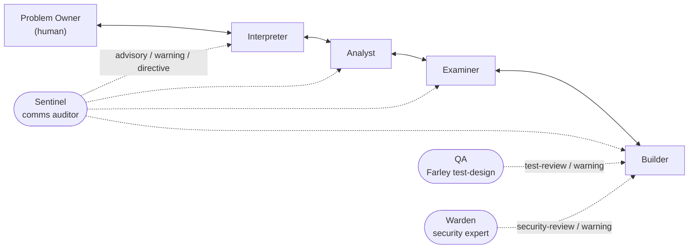
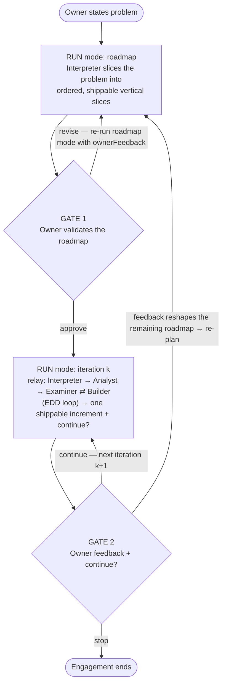

# Agentic Working Model — EDD Relay Chain

A five-role relay where a human's problem is sliced into a validated roadmap and
delivered one potentially shippable increment at a time, through
[Expectation-Driven Development](https://a4al6a.substack.com/p/expectation-driven-development-a)
— with three out-of-chain observers (a **Sentinel**, a **QA** reviewer, and a
**Warden** security expert) watching alongside. Each chain agent talks only to its
immediate neighbours, and every message — including the human's gate decisions — is
recorded in an append-only ledger you can audit.

## The chain



| Role | Was called | Talks to | Transforms… |
|------|------------|----------|-------------|
| **Problem Owner** | Problem Stater | Interpreter | a problem; validates the roadmap; gives feedback + continue/stop each iteration (the human) |
| **Interpreter** | Problem Stater Proxy | Owner, Analyst | problem → **roadmap of shippable iterations**; packages each **increment** back to the Owner |
| **Analyst** | Solver | Interpreter, Examiner | behaviour-to-implement → a crisp **behaviour** |
| **Examiner** | Verifier | Analyst, Builder | behaviour → **expectations**; judges **evidence**; persists each satisfied behaviour as a committed **BDD feature** |
| **Builder** | Implementer | Examiner | expectations → code via **TDD** (test-first); proves each with **evidence** = a demonstrated run of the real system (not "tests pass") |

Names state the *transformation* each node performs. "Solver"/"Verifier" were
renamed because they don't solve or verify code — the Builder solves; the Examiner
sets expectations and judges evidence.

### Observers (outside the chain)

Three agents run alongside the relay but are not links in it — they only ever speak
*one-way*, and no agent replies:

- **Sentinel** — the communication auditor. Reads the whole ledger and may send
  `advisory` / `warning` / `directive` to any agent when a message drifts off-contract
  (e.g. the Builder leaking implementation detail up toward the Examiner).
- **QA** — the test-design reviewer. On new commits it scores the Builder's changed
  tests with the **Farley Index** (Dave Farley's 8 Properties of Good Tests) and sends
  the Builder a `test-review`, or a `warning` when quality drops below a calibrated floor.
- **Warden** — the security expert. On new commits it scans the Builder's changed code
  for vulnerabilities and violations of common security patterns, and sends the Builder
  a `security-review`, or a `warning` on any Critical/High or newly introduced vulnerability.

## Two ways to run it

The same chain, topology, and ledger back two execution surfaces:

- **Workflow orchestrator** (`orchestrator.workflow.js` + `ledger.mjs`) — headless,
  run-by-run; the Owner's gates happen conversationally between runs. This is what the
  sections below describe.
- **iTerm relay swarm** (`relay/`) — each agent is a long-lived Claude session in its
  own iTerm window, and messages travel as filesystem-mailbox files a dispatcher
  delivers; the Sentinel and QA observers run as their own windows. Best when you want
  to watch the agents work live. See [`relay/README.md`](relay/README.md).

## How an engagement runs

The Owner has two gates: **validate the roadmap**, and **per-iteration feedback +
continue?**. A headless workflow run can't pause for a human, so the engagement is
a sequence of workflow runs stitched together by those gates, which happen
conversationally between runs:



One **ledger spans the whole engagement** — every run appends to the same
`ledger/ledger.jsonl`, so the audit trail is continuous across all iterations and
gates.

## The rules of the topology

1. **Send only to neighbours.** An agent may message only its left/right neighbour.
2. **See only your edges.** Each agent is prompted with its two neighbours and only
   its own slice of the conversation. The full ledger belongs to *you, the auditor*.
3. **Fixed vocabulary per edge.** e.g. the Builder may only ever emit `evidence`;
   the Owner→Interpreter edge carries `problem` / `roadmap-verdict` / `feedback` /
   `decision`.
4. **Extraordinary broadcasts.** The Owner can send a `broadcast` — a line-wide
   instruction (a global constraint, a priority shift, "stop after this behaviour").
   It still travels neighbour-to-neighbour: each agent applies it and relays it to
   its downstream neighbour, so it reaches the whole chain
   (owner → interpreter → analyst → examiner → builder).
5. **Out-of-chain observers.** The Sentinel, QA, and Warden sit outside the chain and
   speak one-way only: the Sentinel may message any agent (`sentinel>*`), while QA and
   the Warden message the Builder (`qa>builder`, `warden>builder`). These edges are
   listed in `topology.json` beside the chain edges, so their messages validate too.

These rules live in **`topology.json`** — the single source of truth — and are
enforced in two places that both read it: the orchestrator's in-run `append()`
(rules passed in via `args.topology`) and `ledger.mjs` on persistence.

## Files

| File | Role |
|------|------|
| `topology.json` | **Single source of truth** for adjacency + per-edge message vocabulary. |
| `orchestrator.workflow.js` | The Claude Code Workflow script. `mode:"roadmap"` and `mode:"iteration"`, the agent prompts, and the relay flow. |
| `ledger.mjs` | Persistence chokepoint + auditor CLI (`count` / `append` / `append-batch` / `verify` / `show`). Runnable with `node`. |
| `schema/message.schema.json` | The ledger wire format (one message per line). |
| `ledger/ledger.jsonl` | The audit trail for one engagement. |
| `relay/` | The live **iTerm relay swarm** — one Claude session per role in its own window, filesystem-mailbox delivery, plus the Sentinel + QA observers. See [`relay/README.md`](relay/README.md). |

`orchestrator.workflow.js` runs inside Claude's workflow engine (which provides
`agent()`, `log()`, …) — run it by asking Claude, not with `node`. `ledger.mjs` is
a plain Node script for the human/auditor side.

## Driving it (between-run loop)

The driver (Claude, relaying to you) repeats:

```
# 0. starting seq for the next run
SEQ=$(node ledger.mjs count)

# 1. plan — produces a roadmap for you to validate
Workflow({ scriptPath:"orchestrator.workflow.js",
           args:{ mode:"roadmap", problem:"<your problem>",
                  topology:<topology.json>, seqStart:SEQ }})
#    persist the run's messages, then record YOUR verdict:
node ledger.mjs append-batch <run-output.json>
node ledger.mjs append '{"from":"owner","to":"interpreter","type":"roadmap-verdict","body":"approved"}'

# 2. deliver iteration k — produces a shippable increment + "continue?"
Workflow({ scriptPath:"orchestrator.workflow.js",
           args:{ mode:"iteration", roadmap:<approved roadmap>, iterationIndex:k,
                  topology:<topology.json>, seqStart:$(node ledger.mjs count) }})
node ledger.mjs append-batch <run-output.json>
#    record YOUR feedback + decision:
node ledger.mjs append '{"from":"owner","to":"interpreter","type":"feedback","body":"..."}'
node ledger.mjs append '{"from":"owner","to":"interpreter","type":"decision","body":"continue"}'
# → repeat step 2 for k+1, or re-run step 1 to re-plan, or stop.
```

`seqStart` keeps sequence numbers continuous across runs; the workflow returns its
`messages`, which you persist with `append-batch`. Owner gate messages are appended
directly. Both paths validate against `topology.json`.

## Auditing a run

```bash
node ledger.mjs show       # human-readable replay of the whole engagement
node ledger.mjs verify     # re-checks topology, vocabulary, and gap-free sequence

# Everything the Builder ever said (must be only 'evidence')
jq 'select(.from=="builder")' ledger/ledger.jsonl

# Trace one iteration's lineage
jq 'select(.refs[]? == "I1")' ledger/ledger.jsonl

# Every human gate decision
jq 'select(.from=="owner")' ledger/ledger.jsonl
```

Because the ledger is append-only with a gap-free `seq`, a missing or out-of-order
number is itself an audit signal — `ledger.mjs verify` flags it. Commit
`ledger.jsonl` to git per run for tamper-evident history.

## Why this shape

- **Rules in one data file.** Topology + vocabulary live only in `topology.json`,
  read by both writers. No second place to drift.
- **The model never enforces the audit.** Adjacency, edges, vocabulary, and
  sequence are plain code/data, not something an agent is asked to remember.
- **Human gates are real.** Roadmap validation and per-iteration continue/stop are
  the Owner's decisions, recorded in the same ledger as the machine's messages.
- **EDD, faithfully.** The Examiner authors plain-language **expectations**; the
  Builder returns **evidence** — a demonstrated run of the real system, not "tests
  pass" — preferring *executed* over *generative*; the Examiner judges it
  adversarially and consolidates each satisfied behaviour into a committed **BDD
  feature** (Feature = behaviour, Scenario = expectation + the evidence that proved
  it), so the proof lives with the code. The Builder builds **test-first (TDD)**, and
  those tests double as the regression net EDD calls *stabilising* — but they are the
  Builder's discipline, distinct from the demonstrated evidence that governs
  correctness across the chain.
