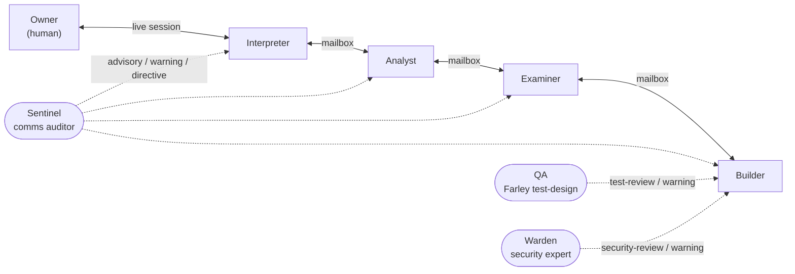
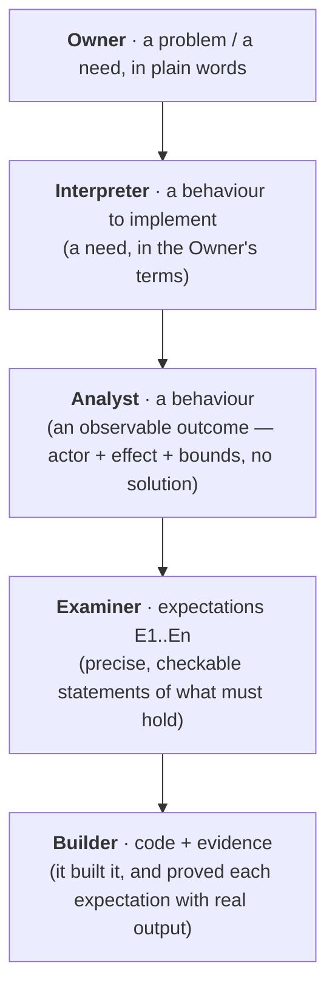
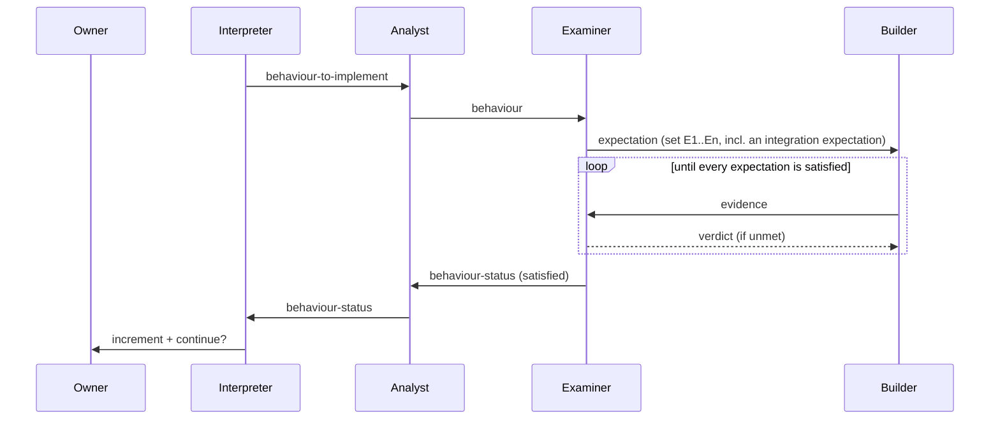

# Filesystem-mailbox relay

Four agents form the chain — each in its own Claude session on this machine, talking
only to their neighbours through plain files — plus three out-of-chain observers (a
**Sentinel**, a **QA** reviewer, and a **Warden** security expert) that watch
alongside. No server, no broker — every message is a file you can `ls`, `cat`, and
replay. A stuck chain is just a message sitting in an inbox.



Only the `owner↔interpreter` edge is a live conversation (the human types in the
Interpreter's session). All three agent-to-agent edges — Interpreter↔Analyst,
Analyst↔Examiner, Examiner↔Builder — go through mailbox files via the relay. The
Sentinel, QA, and Warden stand outside the chain and speak one-way only (dotted): no
agent replies to them.

## Files

```
relay/
  topology.json          the rules: permitted edges + per-edge message vocabulary
  relay.mjs              the CLI: send / inbox / next / ack / show / verify
  ledger.jsonl           append-only audit trail — the single source of truth
  mailbox/<role>/inbox/  messages waiting for <role>
  mailbox/<role>/done/   messages <role> has processed
  agents/<role>.md       the playbook each session adopts

  iterm_launch.py        open the swarm as separate, tiled iTerm windows
  iterm_dispatch.py      push dispatcher — wakes a window when it has mail
  iterm_sentinel.py      trigger that wakes the Sentinel to audit
  iterm_qa.py            trigger that wakes QA to score test design (Farley Index)
  iterm_warden.py        trigger that wakes the Warden to scan changes for vulnerabilities
  iterm_decorate.py      give each window a role badge + background colour
  draw.py                render the ledger as a swimlane comms board (Communication Drawer)
  iterm/windows.json     role -> iTerm session UUID (written by the launcher)
  docwatch.py            optional: wakes a Documenter from git history
```

## Running as separate iTerm windows (recommended)

Each agent gets its own iTerm window, tiled across the screen so you can watch them
all at once. A few small Python tools drive it; all address sessions by their stable
iTerm **session UUID** (window ids get recycled when a window closes, which would
misdeliver a wake).

```
# 1. open the swarm (idempotent: preserves an existing ledger + mailboxes).
#    Hands-off by default (claude --dangerously-skip-permissions). START_DELAY gives
#    claude time to boot before the role kickoff is sent.
START_DELAY=15 python3 relay/iterm_launch.py <swarm-name> <project-dir>

# 2. delivery — wakes a window when its inbox has ledger-verified mail (leave running)
python3 relay/iterm_dispatch.py --home <project-dir>/.relay &

# 3. the Sentinel's audit trigger (leave running)
python3 relay/iterm_sentinel.py --home <project-dir>/.relay &

# 4. the QA reviewer's trigger — wakes QA on new commits to score test design (leave running)
python3 relay/iterm_qa.py --home <project-dir>/.relay &

# 5. the Warden's trigger — wakes the Warden on new commits to scan for vulnerabilities (leave running)
python3 relay/iterm_warden.py --home <project-dir>/.relay &

# 6. (optional) badge + per-role background colour on the live windows
python3 relay/iterm_decorate.py --home <project-dir>/.relay
```

Then talk to the **interpreter** window as the Owner. `node`/`npm` must be on the
agents' PATH (e.g. symlinked into `/opt/homebrew/bin` if you use nvm).

The dispatcher is **rock-solid by design**: it watches inboxes (not the ledger), so
N messages arriving at once cause exactly one wake; it sends the wake in two steps
(text, then a separate newline) so it actually submits instead of pasting; it
only delivers inbox files backed by a real ledger entry from a permitted sender
(so a file dropped straight into a mailbox is ignored); and it re-wakes an idle
window that still has mail, so a dropped wake self-heals.

### Resume after a restart / crash

All state is on disk, so a reboot only loses the *processes*. Re-run the same launch
steps — `iterm_launch.py`'s init is idempotent (keeps the ledger and mailboxes), the
agents re-read their playbooks, and the dispatcher wakes whoever still has pending
mail. The swarm continues from exactly where it stopped. (`iterm_decorate.py` is
worth re-running too, since fresh windows start undecorated.)

### Decoration palette

`iterm_decorate.py` writes a role badge (e.g. `BUILDER`) and a dark-tinted
background to each live window via iTerm escape sequences (no relaunch). Edit the
`PALETTE` at the top of that file to change colours, then re-run it.

### Several swarms at once

Each swarm is fully isolated — its own `RELAY_HOME` (ledger + mailboxes + lock), its
own `iterm/windows.json`, and its own set of iTerm windows — so concurrent swarms on
different projects never cross. Launch each with a different project dir and run one
dispatcher per swarm:

```
python3 relay/iterm_launch.py   alpha ~/code/project-alpha
python3 relay/iterm_dispatch.py --home ~/code/project-alpha/.relay &

python3 relay/iterm_launch.py   beta  ~/code/project-beta
python3 relay/iterm_dispatch.py --home ~/code/project-beta/.relay  &
```

Audit any swarm with `RELAY_HOME=<project>/.relay node relay/relay.mjs show`.

## The message rhythm

The "rhythm" is the fixed sequence of messages that carries **one unit of work**
from the human all the way down to running code and back. Each arrow crosses an
edge, and **every edge is a translation to a different level of abstraction**. That
is the whole point of the chain: detail is not allowed to leak *up* toward the human,
and the human's framing is not allowed to leak *down* into code. Each role only ever
speaks the language of its own edge (the Sentinel audits exactly this — see below).

Going down the chain, the same idea is progressively sharpened:



### One behaviour, end to end



When every expectation is satisfied, the Examiner consolidates the behaviour into a
**committed Gherkin `.feature` file** in the project (Feature = the behaviour, one
Scenario per expectation, each annotated with the real-system evidence that proved
it) before it reports `behaviour-status` — so the proof lives with the code.

Before any of that, there is a **setup phase** between the Owner and the Interpreter
(a live conversation, logged to the ledger): the Owner states the problem, the
Interpreter asks questions and proposes a roadmap, the Owner approves it, and only
then does the Interpreter send the first `behaviour-to-implement`.

### Message types in detail

Every message has a `type`, and `topology.json` fixes which types are legal on each
edge. What each type means and the abstraction it carries:

**Setup & steering — Owner ↔ Interpreter**

| Type | Direction | Meaning |
|------|-----------|---------|
| `problem` | Owner → Interpreter | The human states what they want, in plain language. The start of everything. |
| `question` | Interpreter → Owner | The Interpreter asks for missing information *before* planning, so ambiguity is resolved rather than assumed. |
| `clarification` | Owner → Interpreter | The Owner's answers / refinements to those questions. |
| `roadmap` | Interpreter → Owner | A proposed ordered set of *potentially shippable iterations* (each a few behaviours). Awaits approval. |
| `roadmap-verdict` | Owner → Interpreter | The Owner approves the roadmap or asks for changes (re-ordered, merged, dropped). |
| `increment` | Interpreter → Owner | After an iteration's behaviours are all satisfied, the Interpreter presents the working result. |
| `continue-query` | Interpreter → Owner | "Continue to the next iteration, stop, or re-plan?" — the gate the Owner controls. |
| `feedback` / `decision` | Owner → Interpreter | The Owner's reaction to an increment, and their go / stop / change call. |
| `result` | Interpreter → Owner | Final delivery / summary when the work is done. |

**The build chain — one behaviour's journey**

| Type | Direction | Meaning |
|------|-----------|---------|
| `behaviour-to-implement` | Interpreter → Analyst | One concrete capability from the approved roadmap, still expressed as an **Owner-level need** ("what to build next"), never as a solution. |
| `clarification` | Interpreter → Analyst | Extra context / answers when the Analyst needs them. |
| `question` | Analyst → Interpreter | The Analyst asks back up if a need is ambiguous (it does *not* guess). |
| `behaviour` | Analyst → Examiner | The need reframed as an **observable behaviour**: an actor, an observable outcome, and boundaries — with every hint of *how* stripped out. "What must be observably true." |
| `expectation` | Examiner → Builder | The Examiner decomposes a behaviour into a **set of precise, checkable expectations** (E1..En) — plain-language statements of exactly what must hold, including an end-to-end *integration* expectation. This is the spec the Builder satisfies. Still no "how". |
| `evidence` | Builder → Examiner | A **concrete demonstration of the real system's behaviour** — the Builder actually *runs the program* and shows specific inputs paired with their real outputs (a captured run, a measured value, a screenshot, an API response) proving each expectation holds. EDD prefers *executed* evidence (real output from a real run) over *generative* (narrating what would happen). Note: a passing test the Builder wrote is **not** evidence — that's a second assertion by the same author; the Builder must show the system *doing* the thing. It reports *which expectations now hold*, never implementation detail. |
| `verdict` | Examiner → Builder | The Examiner judges the evidence against the expectations. If anything is unmet or unconvincing, the verdict says what still fails and the Builder iterates — **this loops until every expectation is satisfied**. |
| `behaviour-status` | Examiner → Analyst | Once all expectations pass, the Examiner reports the behaviour as satisfied (with its evidence). |
| `behaviour-status` | Analyst → Interpreter | The Analyst relays it upward as **"which problem was solved"** — back in the Owner's terms, never mentioning expectations, tests, or code. |

**Out-of-band — the Sentinel (auditor, outside the chain)**

| Type | Direction | Meaning |
|------|-----------|---------|
| `advisory` | Sentinel → any agent | A non-blocking heads-up that a message is drifting off-contract (e.g. starting to leak implementation detail). |
| `warning` | Sentinel → any agent | A contract drift the agent should correct on its next message. |
| `directive` | Sentinel → any agent | A corrective instruction (e.g. "restate your last message without the file names"). |

**Out-of-band — QA (test-design reviewer, outside the chain)**

| Type | Direction | Meaning |
|------|-----------|---------|
| `test-review` | QA → Builder | The tests' **Farley Index** (Dave Farley's 8 Properties of Good Tests) with a per-property breakdown and the top fixes, for the tests the Builder just changed. |
| `warning` | QA → Builder | Test-design quality dropped below the calibrated floor — which properties regressed, in which tests, and how to recover. |
| `advisory` | QA → Builder | Production code changed with no test changes (nothing to score), or a minor note. |

**Out-of-band — the Warden (security expert, outside the chain)**

| Type | Direction | Meaning |
|------|-----------|---------|
| `security-review` | Warden → Builder | Findings from scanning the changed code, classified by severity (Critical/High/Medium/Low/Info) with affected locations and concrete fixes, when nothing Critical/High is present. |
| `warning` | Warden → Builder | A Critical/High vulnerability, or a newly introduced one — the severity, the affected code, the impact/exploit path, and the change needed to close it. Must not pass. |
| `advisory` | Warden → Builder | The change was security-irrelevant (nothing to review), or a minor note. |

**Line-wide — the extraordinary broadcast**

| Type | Direction | Meaning |
|------|-----------|---------|
| `broadcast` | Owner → … → Builder | An extraordinary, line-wide instruction (a global constraint, a priority shift, "stop after this behaviour"). The Owner sends it to the Interpreter, and **each agent applies it and forwards it on** to its downstream neighbour — `owner → interpreter → analyst → examiner → builder` — so it reaches every station. Unlike a behaviour, it is passed down with its intent intact, not abstracted away. The Builder, being last, simply applies it. |

The Examiner ⟲ Builder loop (`expectation` → `evidence` → `verdict` → …) is the heart
of **Expectation-Driven Development**: correctness is established by stating
expectations in plain language and proving them with **evidence** — concrete
demonstrations of the running system's real input→output behaviour — which the
Examiner judges adversarially, rather than by the Builder asserting "done."

Keep two things separate:
- **Evidence** is what the Builder shows the Examiner: the system actually *doing*
  the thing (executed runs with real outputs). A passing test is **not** evidence —
  it is a second assertion by the same author.
- **Tests (TDD)** are *how* the Builder builds — `red → green → refactor`, no
  production code without a failing test — and they serve as the regression net
  (EDD calls this *stabilising* validated expectations into automated tests). They
  protect the code over time; they do not stand in for the demonstration.

So: **EDD is the cross-agent contract** (what must hold, proven by demonstrated
evidence the Examiner judges), and **TDD is the Builder's internal discipline**
(how it implements, plus regression safety).

## Sending and receiving

Every send is validated against `topology.json` — wrong neighbour or wrong message
type for the edge is rejected before anything is written:

```
node relay/relay.mjs send  --as analyst --to examiner --type behaviour --body "..." --refs B1
node relay/relay.mjs inbox --as examiner            # what's waiting
node relay/relay.mjs next  --as examiner            # read the oldest (JSON)
node relay/relay.mjs ack   --as examiner --seq 7    # move it to done/
```

Long bodies: use `--body-file path`, or pipe on stdin with `-`.

## Auditing

```
node relay/relay.mjs show       # human-readable replay of the whole conversation
node relay/relay.mjs verify     # re-checks topology, vocabulary, gap-free sequence
```

`ledger.jsonl` is append-only with a gap-free `seq`, so a missing or out-of-order
number is itself a signal. Each session's own Claude transcript is a second,
independent record. Commit `ledger.jsonl` per engagement for tamper-evident history.

## Observers (outside the chain)

These run alongside the swarm but are not links in the chain. The Communication
Drawer and Documenter only read. Three observers also *speak* — one-way — to keep the
chain honest: the **Sentinel** may send `advisory`/`warning`/`directive` to any agent
(the `sentinel>*` edges in `topology.json`), **QA** sends `test-review`/`warning` to
the Builder (the `qa>builder` edge), and the **Warden** sends `security-review`/`warning`
to the Builder (the `warden>builder` edge). No agent replies to any of them.

- **Sentinel** (`agents/sentinel.md` + `iterm_sentinel.py`) — the Communication
  Auditor. Periodically audits the ledger for per-edge contract breaches (e.g. the
  Builder leaking implementation detail up to the Examiner), writes findings to
  `<RELAY_HOME>/audit/`, and may advise the offending agent directly
  (`sentinel>*` edges). Its window is opened by `iterm_launch.py`; wake it on a
  schedule with `python3 relay/iterm_sentinel.py --home <project>/.relay`.
- **QA** (`agents/qa.md` + `iterm_qa.py`) — the Test-Design Reviewer. Whenever the
  project has new commits, it reads the staged diff, scores the changed tests'
  **Farley Index** (Dave Farley's 8 Properties of Good Tests) with the
  `alf-test-design-reviewer` agent, and sends the Builder a `test-review` — or a
  `warning` if quality drops below the calibrated floor in `<RELAY_HOME>/qa/policy.json`
  — over the one-way `qa>builder` edge; the Builder does not reply. Its window is
  opened by `iterm_launch.py`; wake it on a schedule with
  `python3 relay/iterm_qa.py --home <project>/.relay`.
- **Warden** (`agents/warden.md` + `iterm_warden.py`) — the Security Expert. Whenever
  the project has new commits, it reads the staged diff, scans the changed code for
  vulnerabilities and violations of common security patterns with the
  `alf-security-assessor` agent, classifies findings by severity, and sends the Builder
  a `security-review` — or a `warning` on any Critical/High or newly introduced
  vulnerability — over the one-way `warden>builder` edge; the Builder does not reply.
  Its window is opened by `iterm_launch.py`; wake it on a schedule with
  `python3 relay/iterm_warden.py --home <project>/.relay`.
- **Communication Drawer** (`draw.py`) — renders the ledger as a Kaleidoscope-style
  swimlane board (one lane per agent, expandable message cards, direction arrows).
  Deterministic; re-run anytime:
  `python3 relay/draw.py --home <project>/.relay` → `<RELAY_HOME>/comms-site/index.html`.
- **Documenter** (`agents/documenter.md` + `docwatch.py`) — maintains an **end-user
  documentation website** (Docusaurus + Mermaid diagrams, deployable to Vercel).
  `docwatch.py` watches the project's git history and wakes the Documenter with the
  diff since it last looked; the agent updates the docs and advances its cursor.
  Optional, and not yet wired into the iTerm launcher — open a Documenter window
  yourself, then run the watcher against the project's `.relay`. Requires the
  Builder to commit its work (it does — see `agents/builder.md`).

## Why this resists getting stuck

All state is inspectable files — there is no hidden broker/connection state to
wedge. If an agent stalls, its unprocessed message is visibly sitting in its inbox;
re-run that one session and it picks up exactly where it left off (`done/` + the
`in_reply_to` field make reprocessing idempotent).
